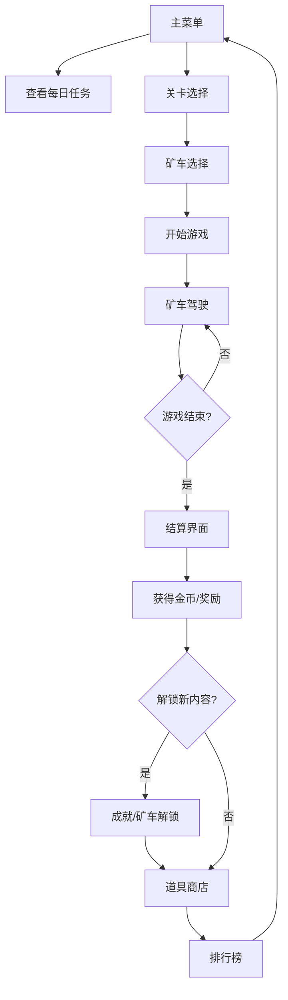

## 1. 产品概述

复古风横版矿车桌面游戏，为休闲玩家提供像素矿洞冒险体验和分数挑战乐趣。玩家驾驶矿车在危险的矿洞中穿梭，收集矿石、躲避障碍、使用道具，挑战更高分数并解锁丰富内容。

- 核心玩法：横版卷轴跑酷类游戏，通过切轨、跳跃躲避障碍，收集矿石获得分数
- 目标用户：休闲游戏玩家，像素风格爱好者
- 产品价值：碎片化时间娱乐，成就收集乐趣，复古像素美学体验

## 2. 核心功能

### 2.1 用户角色

| 角色 | 注册方式 | 核心权限 |
|------|---------|---------|
| 玩家 | 本地存储，无需注册 | 完整游戏体验，本地进度保存 |

### 2.2 功能模块

1. **主菜单**：游戏开始入口、剧情展示、每日任务提醒
2. **关卡选择**：普通关卡、限时挑战关卡、已解锁矿车选择
3. **矿车驾驶**：核心游戏玩法，左右切轨、跳跃、道具使用
4. **道具商店**：购买护盾、磁铁、复活等道具和矿车外观
5. **成就图鉴**：成就徽章展示、解锁进度、像素剧情
6. **排行榜**：本地最佳分数、历史记录、挑战关卡排名
7. **本地设置**：音效调节、画面设置、进度管理

### 2.3 页面详情

| 页面名称 | 模块名称 | 功能描述 |
|---------|---------|---------|
| 主菜单 | 标题区域 | 像素风游戏Logo、动态矿车动画 |
| 主菜单 | 功能按钮 | 开始游戏、关卡选择、商店、成就、排行榜、设置 |
| 主菜单 | 每日任务 | 显示今日任务及完成进度 |
| 关卡选择 | 关卡列表 | 普通关卡、限时关卡，显示解锁状态和最佳分数 |
| 关卡选择 | 矿车选择 | 已解锁矿车展示，属性对比 |
| 矿车驾驶 | 游戏画面 | 横版卷轴矿洞场景、三轨道系统 |
| 矿车驾驶 | 操作控制 | 左右切轨、跳跃、道具使用按钮 |
| 矿车驾驶 | HUD显示 | 分数、距离、矿石数量、生命值、道具状态 |
| 矿车驾驶 | 游戏元素 | 矿石、障碍物、加速带、塌方、蝙蝠 |
| 道具商店 | 道具购买 | 护盾、磁铁、双倍分数等道具 |
| 道具商店 | 矿车商店 | 新矿车解锁、外观皮肤购买 |
| 成就图鉴 | 成就徽章 | 成就列表、解锁状态、奖励展示 |
| 成就图鉴 | 像素剧情 | 分段解锁的像素风格剧情漫画 |
| 排行榜 | 分数排行 | 各关卡最佳分数、总排名 |
| 排行榜 | 精彩回放 | 历史高分记录的精彩片段回放 |
| 本地设置 | 音效设置 | 背景音乐、音效音量调节 |
| 本地设置 | 画面设置 | 像素画质、屏幕震动、粒子效果开关 |
| 本地设置 | 数据管理 | 进度保存、重置、导出 |

## 3. 核心流程

玩家进入主菜单 → 查看每日任务 → 选择关卡 → 选择矿车 → 开始游戏 → 驾驶矿车收集矿石躲避障碍 → 使用道具 → 游戏结束 → 查看分数 → 获得奖励 → 解锁成就/矿车 → 前往商店购买道具 → 查看排行榜

## 4. 用户界面设计

### 4.1 设计风格

- **主色调**：深褐色 (#3D2914)、土黄色 (#C4A35A)、矿石蓝 (#4A90D9)
- **辅助色**：岩浆红 (#E74C3C)、宝石绿 (#2ECC71)、金属灰 (#7F8C8D)
- **按钮风格**：像素风3D凸起按钮，带像素边框，按下时有凹陷动画
- **字体**：像素风格字体 (Press Start 2P) + 中文像素字体
- **布局风格**：居中卡片式布局，像素边框装饰，复古CRT扫描线效果
- **图标风格**：8-bit像素艺术风格图标，矿石、矿车、镐头等元素

### 4.2 页面设计概述

| 页面名称 | 模块名称 | UI元素 |
|---------|---------|--------|
| 主菜单 | 标题区域 | 像素动画Logo，动态矿车轨道背景，扫描线滤镜 |
| 主菜单 | 功能按钮 | 垂直排列像素按钮，hover时矿石闪烁效果 |
| 矿车驾驶 | 游戏画面 | 三层轨道视差滚动，矿洞岩壁纹理，动态矿车动画 |
| 矿车驾驶 | HUD | 左上角分数，右上角生命值，底部道具栏，像素字体 |
| 道具商店 | 商品列表 | 像素卡片布局，商品图标，价格标签，购买按钮 |
| 成就图鉴 | 徽章展示 | 网格布局，已解锁彩色徽章，未解锁灰色轮廓 |

### 4.3 响应性

- 桌面端优先设计，固定1280x720游戏画布
- 支持窗口缩放，保持16:9比例
- 键盘操作 (方向键/WASD) + 鼠标点击
- 触屏设备支持虚拟按钮

### 4.4 动画与特效

- **矿车动画**：车轮滚动、颠簸震动、跳跃抛物线
- **矿石收集**：闪烁发光、飞向分数栏、粒子效果
- **碰撞效果**：屏幕震动、像素爆炸粒子、护盾破碎
- **加速带**：速度线、动态模糊、橙色光效
- **过渡动画**：像素溶解、滑动切换、淡入淡出
