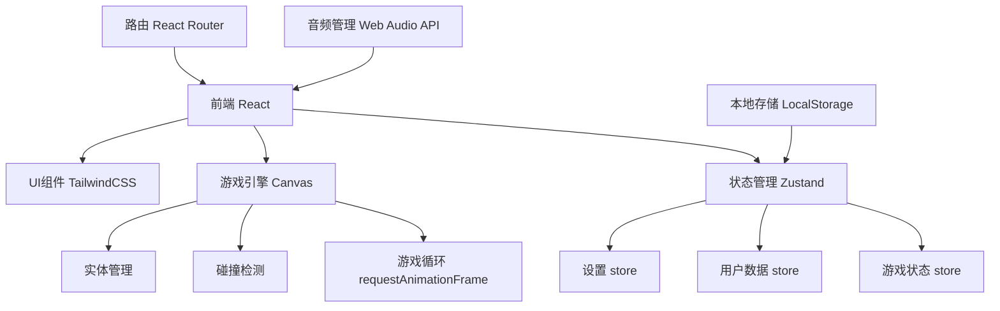
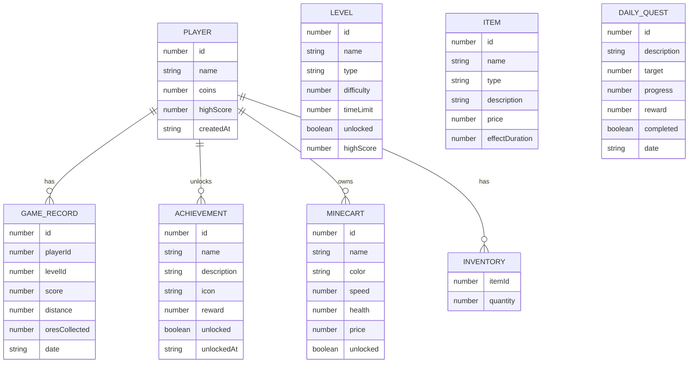

## 1. 架构设计



## 2. 技术描述

- **前端框架**：React@18 + TypeScript + Vite
- **状态管理**：Zustand
- **路由管理**：React Router DOM
- **样式方案**：TailwindCSS@3
- **游戏渲染**：HTML5 Canvas 2D
- **音频系统**：Web Audio API
- **数据存储**：LocalStorage
- **图标库**：Lucide React

## 3. 路由定义

| 路由 | 页面 | 用途 |
|------|------|------|
| / | MainMenu | 主菜单 |
| /level-select | LevelSelect | 关卡选择 |
| /game | Game | 矿车驾驶游戏界面 |
| /shop | Shop | 道具商店 |
| /achievements | Achievements | 成就图鉴 |
| /leaderboard | Leaderboard | 排行榜 |
| /settings | Settings | 本地设置 |

## 4. 数据模型

### 4.1 数据实体关系



### 4.2 核心数据结构

```typescript
// 玩家数据
interface PlayerData {
  id: string;
  name: string;
  coins: number;
  totalScore: number;
  unlockedMinecarts: number[];
  currentMinecart: number;
  achievements: number[];
  inventory: Record<number, number>;
  settings: GameSettings;
}

// 游戏设置
interface GameSettings {
  soundVolume: number;
  musicVolume: number;
  screenShake: boolean;
  particles: boolean;
  pixelQuality: 'low' | 'medium' | 'high';
}

// 游戏状态
interface GameState {
  isPlaying: boolean;
  isPaused: boolean;
  isGameOver: boolean;
  score: number;
  distance: number;
  ores: number;
  health: number;
  currentTrack: number;
  speed: number;
  activeEffects: ActiveEffect[];
}

// 游戏实体
interface Entity {
  id: string;
  type: 'ore' | 'obstacle' | 'bat' | 'cavein' | 'boost' | 'shield' | 'magnet';
  x: number;
  y: number;
  width: number;
  height: number;
  track: number;
  value?: number;
}

// 关卡配置
interface LevelConfig {
  id: number;
  name: string;
  type: 'normal' | 'timed';
  difficulty: 1 | 2 | 3 | 4 | 5;
  timeLimit?: number;
  background: string;
  obstacleFrequency: number;
  oreFrequency: number;
  speedMultiplier: number;
}
```

## 5. 项目结构

```
src/
├── components/          # 可复用组件
│   ├── ui/             # 基础UI组件 (按钮、卡片等)
│   ├── game/           # 游戏相关组件
│   └── layout/         # 布局组件
├── pages/              # 页面组件
│   ├── MainMenu.tsx
│   ├── LevelSelect.tsx
│   ├── Game.tsx
│   ├── Shop.tsx
│   ├── Achievements.tsx
│   ├── Leaderboard.tsx
│   └── Settings.tsx
├── hooks/              # 自定义Hooks
│   ├── useGameLoop.ts
│   ├── useKeyboard.ts
│   └── useLocalStorage.ts
├── store/              # Zustand状态管理
│   ├── usePlayerStore.ts
│   ├── useGameStore.ts
│   └── useSettingsStore.ts
├── game/               # 游戏核心逻辑
│   ├── engine.ts       # 游戏引擎
│   ├── physics.ts      # 物理碰撞
│   ├── entities.ts     # 实体管理
│   └── renderer.ts     # Canvas渲染
├── data/               # 静态数据配置
│   ├── levels.ts
│   ├── minecarts.ts
│   ├── items.ts
│   └── achievements.ts
├── utils/              # 工具函数
│   ├── audio.ts
│   ├── storage.ts
│   └── pixel.ts
├── types/              # TypeScript类型定义
│   └── index.ts
├── App.tsx
├── main.tsx
└── index.css
```

## 6. 核心模块说明

### 6.1 游戏引擎模块
- 使用 `requestAnimationFrame` 实现60fps游戏循环
- 固定时间步长更新游戏逻辑，独立于渲染帧率
- 实体系统管理所有游戏对象的创建、更新、销毁

### 6.2 物理碰撞模块
- AABB (轴对齐包围盒) 碰撞检测
- 三轨道系统的轨道切换逻辑
- 跳跃抛物线运动计算

### 6.3 渲染模块
- Canvas 2D像素风格渲染
- 视差滚动背景
- 粒子特效系统
- CRT扫描线滤镜效果

### 6.4 音频模块
- Web Audio API 合成8-bit音效
- 背景音乐循环播放
- 音效池管理，支持多音效同时播放

### 6.5 存储模块
- LocalStorage 自动保存玩家进度
- 游戏数据加密存储
- 支持数据导入导出
